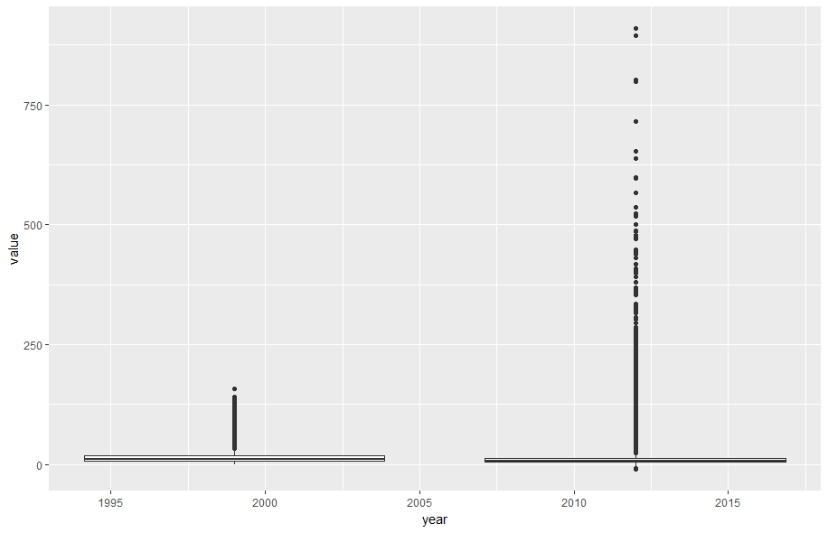
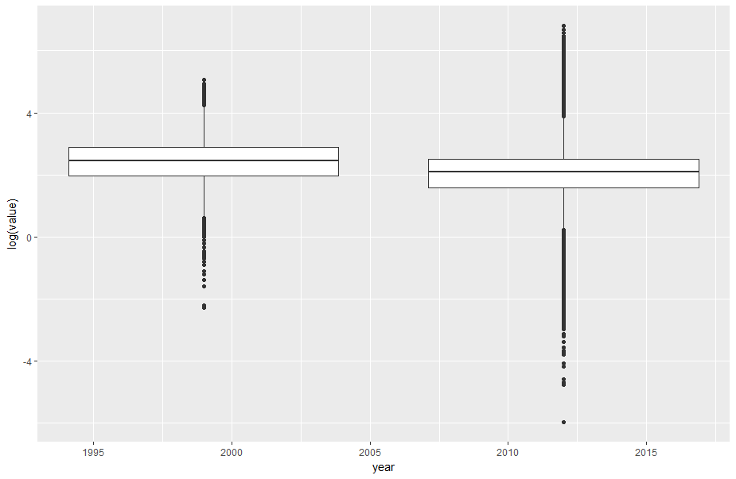
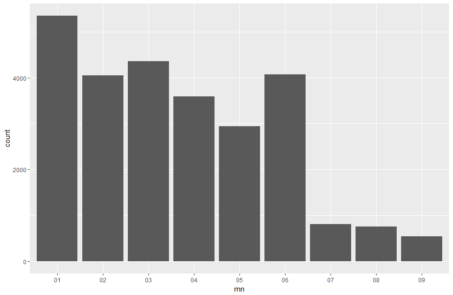
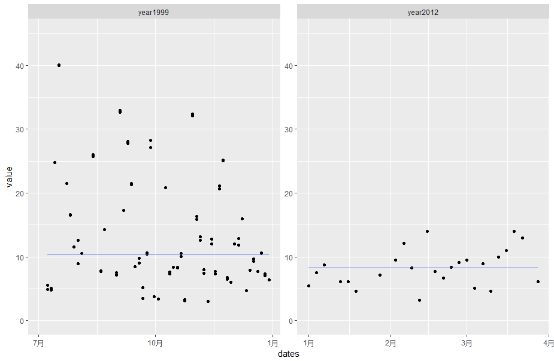
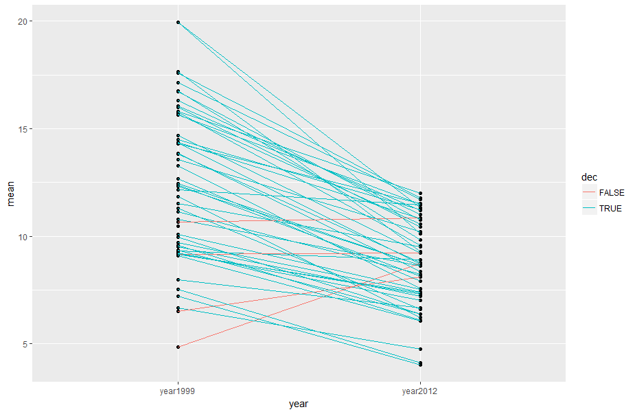

# PM2.5_Analysis

首先，读取压缩数据
-----------

```r
pm0 <- read.table("./dataset/airData1999.txt.gz", comment.char = "#", header = FALSE, sep = "|",na.strings = "")
pm1 <- read.table("./dataset/airData2012.txt.gz", comment.char = "#", header = FALSE, sep = "|",na.strings = "")
pm1 <- readLines("./dataset/header.txt.gz", 1)
```

整理数据，修改列名
```r
cnames <- strsplit(cnames, "|", fixed = TRUE)
wcol <- c(3,4,5,11,13)
names(pm0) <- make.names(cnames[[1]][wcol])
names(pm1) <- make.names(cnames[[1]][wcol])
```

再来看一下数据

```r
head(pm0)
```

```
##  State.Code County.Code Site.ID     Date Sample.Value
##2          1          27       1 19990106           NA
##3          1          27       1 19990109           NA
##4          1          27       1 19990112        8.841
##5          1          27       1 19990115       14.920
##6          1          27       1 19990118        3.878
```
sample.value 是各个地区在不同时间点获得的pm2.5值，因此这列数据是我们需要重点关注的，似乎1999年很多记录中pm2.5数据为空值。
```R
x0 <- pm0$Sample.Value
str(x0)
mean(is.na(x0))
```
```
 ##num [1:117421] NA NA NA 8.84 14.92 ...
 ##[1] 0.1125608
```
```R
x1 <- pm1$Sample.Value
mean(is.na(x1))
```
```
##[1] 0.05607125
```
我们注意到1999年pm2.5记录缺失量为11%，而2012年pm2.5缺失量为5.6%。可能的原因是当时很多检测点还没有普及pm2.5监测。
我们分别总结一下这两年的pm数据。

```R
summary(x0)
summary(x1)
```
```R
##   Min. 1st Qu.  Median    Mean 3rd Qu.    Max.    NA's 
##   0.00    7.20   11.50   13.74   17.90  157.10   13217 

##   Min. 1st Qu.  Median    Mean 3rd Qu.    Max.    NA's 
## -10.00    4.00    7.63    9.14   12.00  909.00   73133 
```
从均值和中间值看2012年pm2.5似乎已经有了明显的好转，但是最小值为-10，最大值也达到了900+。数据似乎有问题。
先画个箱线图看看。
```R
dx0 <- data.frame(year = 1999, value = x0)
dx1 <- data.frame(year = 2012, value = x1)
dx0x1 <- rbind(dx0,dx1)
ggplot2(dx0x1,aes(x=year,y=value,fill=year))+geom_boxplot()
```


除了看出2012年pm2.5分布比较分散以外，似乎看不出什么别的来。由于数值range比较大，可以试试用log函数处理一下再画图。
```R
ggplot2(dx0x1,aes(x=year,y=log(value),fill=year))+geom_boxplot()
```

从这张图似乎可以获得一些信息：
1. warning信息告诉我们存在小于0的数值（小于0的数值进行log会产生NaN）
4. 箱线图可以看出2012pm2.5的中值确实比1999pm2.5中值要低


如果负数值在后面的分析中保留，肯定会影响我们最终的分析结果，因此有理由对负数值进一步研究。
```R
negative <- x1 <0
mean(negative, na.rm = TRUE) 
```
```R
##[1] 0.0215034
```
负数值只占总数的2%。根据时间对负值进行分析。
```R
dates <- pm1$Date
dates <-substr(dates, 5,6)
mn <- dates[negative]
mn <- mn[!is.na(mn)]
qplot(mn)
```

暂且只能理解为设备误差，负数值在后面的分析中会忽略掉。
为了排除地理因素对pm2.5数值差异的影响，我们选择一个州来分析pm2.5数值差异。
```R
site0 <- unique(subset(pm0, State.Code == 36, c(County.Code, Site.ID)))
site1 <- unique(subset(pm0, State.Code == 36, c(County.Code, Site.ID)))
site0 <- paste(site0[,1], site0[,2])
site1 <- paste(site1[,1], site1[,2])
site0
site1
```
```R
## [1] "1.5"     "1.12"    "5.73"    "5.80"    "5.83"    "5.110"   "13.11"   "27.1004" "29.2"    "29.5"    "29.1007" "31.3" ##   "47.11"   "47.76"   "55.6001" "59.5"    "59.8"    "59.11"   "61.10"   "61.56"   "61.62"   "63.2008" "65.2001" "67.19"  ## "67.1015" "81.94"   "81.97"   "85.55"   "85.67"   "89.3001" "93.3"    "101.3"   "103.1" 

## [1] "1.5"     "1.12"    "5.80"    "5.133"   "13.11"   "29.5"    "31.3"    "47.122"  "55.1007" "61.79"   "61.134"  "63.2008" "67.1015" "71.2"  "81.124"  "85.55"   "101.3"   "103.2" 
```
从结果看，1999年的监测点和2012年的监测点存在部分差异，为了更好的对照，我们选择那些能够同时提供1999和2012年数据的点来研究
```R
##[1] 0.0215034
```
负数值只占总数的2%，通过地区和时间都没有发现负数值的出现有明显规律，暂且只能理解为设备误差，负数值在后面的分析中会忽略掉。

为了排除地理因素对pm2.5数值差异的影响，我们选择一个州来分析pm2.5数值差异。
```R
both <- intersect(site0, site1)
```
我们根据地理位置，对原有数据进行筛选，对筛选结果进行统计
```R
cnt0 <- subset(pm0, State.Code == 36 & county.site %in% both)
cnt1 <- subset(pm1, State.Code == 36 & county.site %in% both)
sapply(split(cnt0, cnt0$county.site), nrow)
sapply(split(cnt1, cnt1$county.site), nrow)
```

```R
    #1.12     1.5   101.3   13.11    29.5    31.3    5.80 63.2008 67.1015   85.55 
    # 61     122     152      61      61     183      61     122     122       7 
     
    #1.12     1.5   101.3   13.11    29.5    31.3    5.80 63.2008 67.1015   85.55 
    # 31      64      31      31      33      15      31      30      31      31 
```
限定了地点后，数据数量减少了很多，有意思的是除了85.5这个地点，其他的地点的年记录数据似乎变少了。
接下来，可以通过画图来对比一下纽约1999年和2012年pm2.5的差异。
```R
    pm0sub <- subset(cnt0, County.Code==63 & Site.ID==2008)
    pm1sub <- subset(cnt1, County.Code==63 & Site.ID==2008)
    x0sub <- pm0sub$Sample.Value
    x1sub <- pm1sub$Sample.Value
    dates0 <- as.Date(as.character(pm0sub$Date),"%Y%m%d")
    dates1 <- as.Date(as.character(pm1sub$Date),"%Y%m%d")
    df99 <- data.frame(year = "year1999", dates = dates0, value = x0sub)
    df12 <- data.frame(year = "year2012", dates = dates1, value = x1sub)
    dfNY <- rbind(df99,df12)
    g <- ggplot(dfNY, aes(dates, value))
    g + geom_point() + facet_wrap(~year, scales = "free") +geom_quantile(formula = y ~y ,quantiles = 0.5) + ylim(0,45)
```

 
 
 通过对比我们可以发现在纽约，2012年的pm2.5值应该是要比1999年低的。
 由此我们可以把不同地区不同年份pm2.5对比结果都表示出来，看全国整体的情况。
```R    
    mn0 <- with(pm0,tapply(Sample.Value,State.Code,mean,na.rm=TRUE))
    mn1 <- with(pm1,tapply(Sample.Value,State.Code,mean,na.rm=TRUE))
    summary(mn0)
    summary(mn1)
```

```R
#   Min. 1st Qu.  Median    Mean 3rd Qu.    Max. 
#  4.862   9.519  12.310  12.410  15.640  19.960 

#   Min. 1st Qu.  Median    Mean 3rd Qu.    Max. 
#  4.006   7.355   8.729   8.759  10.610  11.990 
```
由此我们可以得出大概结论：**从美国全国范围看，2012年各地pm2.5相比于1999年是要降低的**
为了更好的展示数据，可以把这种变化用图画出来。
```R    
    d0 <- data.frame(state = names(mn0), mean = mn0)
    d1 <- data.frame(state = names(mn1), mean = mn1)
    mrg <- merge(d0, d1, by = "state")
    d00 <- data.frame(d0, year = "year1999")
    d11 <- data.frame(d0, year = "year2012")
    df < rbind(d00,d11)
    ggplot(df, aes(year,mean))+geom_point()+geom_segment(aes(x= "year1999",y= mrg[,2],xend = "year2012",yend=mrg[,3]),data = mrg)
```

如图所示，大多数地区的pm2.5数值都是呈下降趋势。少数地区出现上升。
```R    
mrg[mrg$mean.x < mrg$mean.y,]
```
```R    
#   state    mean.x    mean.y
#6     15  4.861821  8.749336
#23    31  9.167770  9.207489
#27    35  6.511285  8.089755
#33    40 10.657617 10.849870
```
所以我们可以得出最终的结论：**从1999年到2012年，美国92%（48）州pm2.5数值出现下降，8%（4）州pm2.5数值出现增长，从全国范围看，美国各地pm2.5数值呈下降趋势。**

